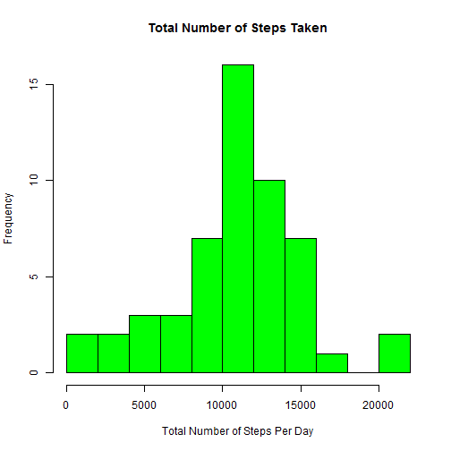
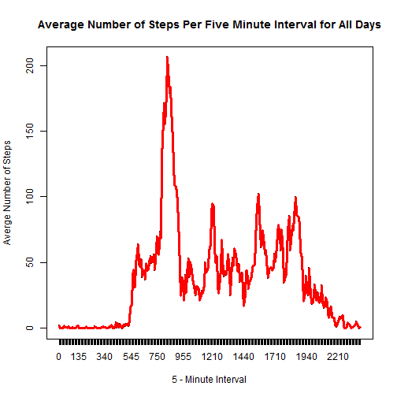
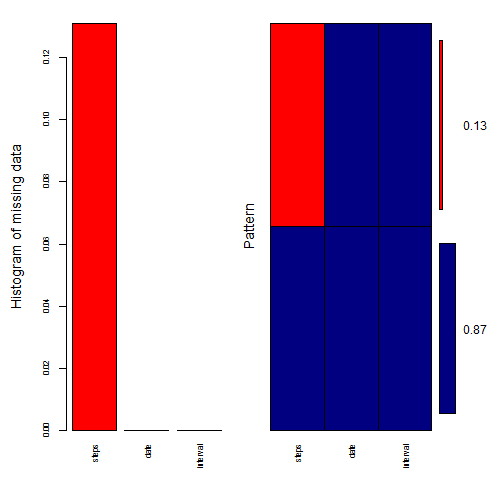
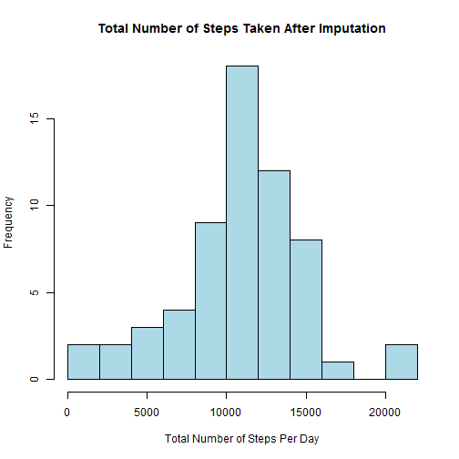
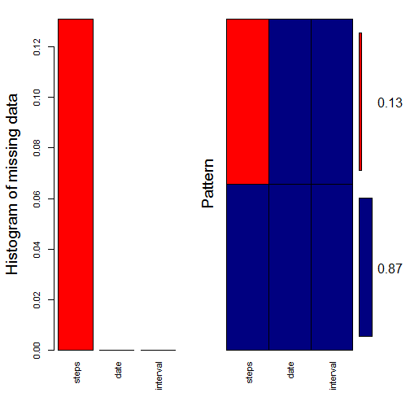
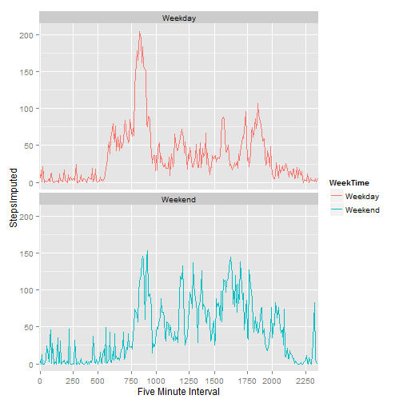

# Reproducible Research Course Assignment 1
## Author: Edwin St Catherine
January 10, 2016  
HTML Document

This is an R Markdown document. This document explains the steps which I took in completing this course assignment.  

###1. Loading Datasets  
*The following code loads the required library files, sets the default directory used  and loads the data. It then summarizes the data to obtain the total number of steps per day required to produce this first graph*

```r
library(plyr)
library(dplyr)
library(lubridate)
library(ggplot2)
library(knitr)
library(mice)
library(VIM)
library(car)
setwd("C:/Users/Edwin/Documents/R/RRProjects")
fileurl <- "C:/Users/Edwin/Documents/R/RRProjects/activity.csv"
Plt_dat <- read.csv(fileurl, sep = ",", na.strings = "NA", colClasses=c('numeric','Date','numeric'))
Plot_dat <- Plt_dat %>% group_by(date) %>% summarise_each(funs(sum), steps)
```

###2. Histogram of the number of steps taken each day

```r
hist(Plot_dat$steps, breaks=10, main = "Total Number of Steps Taken", xlab = "Total Number of Steps Per Day", col = "green")
```

 

```r
dev.off()
```

```
## RStudioGD 
##         2
```

###3. Mean and median number of steps taken each day

```r
mean(Plot_dat$steps, na.rm=TRUE)
```

```
## [1] 10766.19
```

```r
median(Plot_dat$steps, na.rm=TRUE)
```

```
## [1] 10765
```

###4. Time series plot of the average number of steps taken
*The following code factors the interval variable and uses it to compute the mean number of steps taken per day, then produces the required graph*  

```r
Plt_dat$interval <- factor(Plt_dat$interval)
Plot2_dat <- Plt_dat %>% group_by(interval) %>% summarise_each(funs(mean(., na.rm = TRUE)), steps)
par(mfrow = c(1,1))
with(Plot2_dat, plot(interval, steps, main = "Average Number of Steps Per Five Minute Interval for All Days", xlab ="5 - Minute Interval", ylab = "Averge Number of Steps", type = "l"))
lines(Plot2_dat$interval, Plot2_dat$steps,col="red", lwd = 3)
```

 

```r
dev.off()
```

```
## RStudioGD 
##         2
```

###5. The 5-minute interval that, on average, contains the maximum number of steps

```r
MaxAvgSteps <- arrange(Plot2_dat,steps)
tail(MaxAvgSteps$steps,1)
```

```
## [1] 206.1698
```

###6. Code to describe and show a strategy for imputing missing data
*The following code first assesses the nature of the missing values in the steps field, it then outlines a method for imputing the missing data, then it renames the StepsImputed field containing the imputed values (note imputed values do not overwrite any real values) to be used to create the requested graph*  

```r
pMiss <- function(x){sum(is.na(x))/length(x)*100}
apply(Plt_dat,2,pMiss)
```

```
##    steps     date interval 
## 13.11475  0.00000  0.00000
```

```r
aggr_plot <- aggr(Plt_dat, col=c('navyblue','red'), numbers=TRUE, sortVars=TRUE, labels=names(Plt_dat), cex.axis=.7, gap=3, ylab=c("Histogram of missing data","Pattern"))
```

 

```
## 
##  Variables sorted by number of missings: 
##  Variable     Count
##     steps 0.1311475
##      date 0.0000000
##  interval 0.0000000
```

```r
random.imp <- function (a){
        missing <- is.na(a)
        n.missing <- sum(missing)
        a.obs <- a[!missing]
        imputed <- a
        imputed[missing] <- sample (a.obs, n.missing, replace=TRUE)
        return (imputed)
}
Pltsteps <-  data.frame(random.imp(Plt_dat$steps))
Plt_dat1 <- cbind(Plt_dat,Pltsteps)
names(Plt_dat1)[names(Plt_dat1)=="random.imp.Plt_dat.steps."] <- "StepsImputed"
```

###7. Histogram of the total number of steps taken each day after missing values are imputed
*Here we plot the graph with the StepsImputed field generated in step 6 above, then we compute the mean and median to see how they differ from the case where the imputed values were excluded*

```r
Plot_dat2 <- Plt_dat1 %>% group_by(date) %>% summarise_each(funs(sum), StepsImputed)
hist(Plot_dat2$StepsImputed, breaks=10, main = "Total Number of Steps Taken After Imputation", xlab = "Total Number of Steps Per Day", col = "lightblue", border = "black")
```

 

```r
dev.off()
```

```
## RStudioGD 
##         2
```

```r
mean(Plot_dat2$StepsImputed, na.rm=TRUE)
```

 

```
## [1] 10767.89
```

```r
median(Plot_dat2$StepsImputed, na.rm=TRUE)
```

```
## [1] 10765
```

###8. Panel plot comparing the average number of steps taken per 5-minute interval across weekdays and weekends
*First we create the weekday variable then we use the car package to recode it to two categories weekday and weekend then we plot it*  

```r
Plt_dat1$interval <- factor(Plt_dat1$interval)
Plt_wd <- mutate(Plt_dat1, WeekTime=weekdays(date))
Plt_wd$WeekTime <- recode(Plt_wd$WeekTime, "c('Saturday', 'Sunday')='Weekend'; else='Weekday'")
Plt_wd$WeekTime <- factor(Plt_wd$WeekTime)
Plt_wday <- Plt_wd %>% group_by(interval, WeekTime) %>% summarise_each(funs(mean(., na.rm = TRUE)), StepsImputed)
p <- ggplot(Plt_wday, aes(x = interval, y = StepsImputed, group=WeekTime, colour=WeekTime)) + scale_x_discrete(name="Five Minute Interval", breaks=seq(0,3000,250)) + geom_line() + facet_wrap(~ WeekTime, ncol = 1)
print(p)
```

 

```r
dev.off()
```

```
## RStudioGD 
##         2
```
